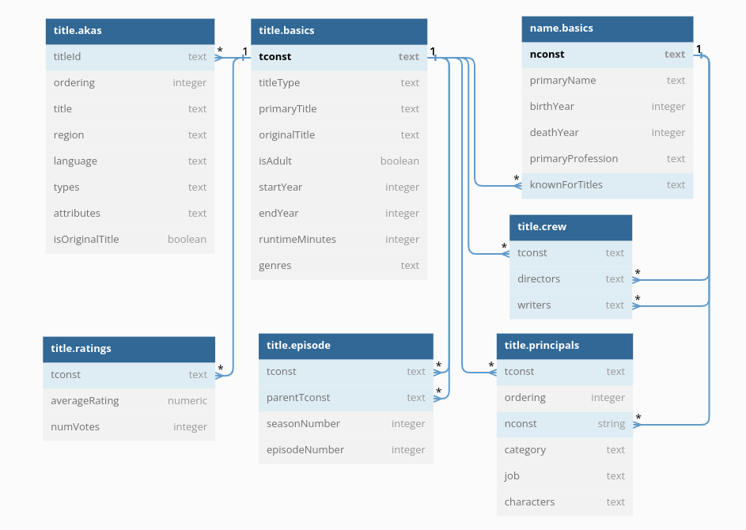

# 🎥 IMpgDB 💽

Scripts to setup and populate a postgres instance for the [IMDB database](https://www.imdb.com/interfaces/).

I wrote this primarily so that I'd have a somewhat interesting database that I could practice my SQL against.

To use, clone repo and run `make build` to build the docker image. This will take a few minutes at least, depending on your internet connection, as it requires downloading around a gigabyte of raw data from [here](https://datasets.imdbws.com/).

Once the image has been successfully built, run `make start` to start a container running the image.

The database tables are initialised and populated upon starting the container for the first time, and **you will be unable to connect to the postgres database until this has been completed** - this will take at least around 5-10 minutes! 

However, once the docker container has been started and the database populated for the first time, you may stop *(but not remove)* the container without having to repopulate it on subsequent starts.  

You may then connect to and browse the database using your preferred postgres client (psql, pgAdmin, etc.), using the following settings and credentials:
```
host: localhost
port: 5432
user: postgres
password: docker
database: imdb
```

Note that the total size of the database is currently around 6GB.

### Database schema

